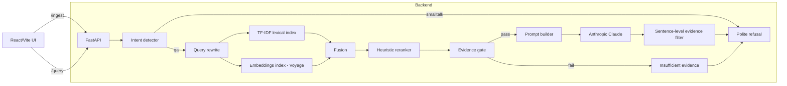

# RAG Pipeline (FastAPI + React) — Assignment

This repo contains a minimal Retrieval-Augmented Generation (RAG) backend and UI scaffold. Priority: accuracy > simplicity > speed.

## Basic design specs (at a glance)
- Private demo: no auth/rate‑limit; single‑tenant; local dev (macOS/Linux), Python 3.12.
- Data assumptions:
  - PDFs: digitally born (no OCR); per‑file ≤ 25 MB; ≤ 10 files per upload.
  - Corpus scale: ≤ 50 PDFs total, ≤ ~2k pages; memory budget ~2 GB for indices.
  - Persistence: file‑backed under `backend/data/` (no database, ephemeral; re‑ingest acceptable).
- Ingestion:
  - Extraction: PyMuPDF plain text + heading hints.
  - Chunking: hybrid, heading‑bounded with ~1k‑token target, ~15% overlap; metadata (doc_id, page_range, headings_path).
- Retrieval:
  - Lexical: TF‑IDF (1–2 grams, english stopwords), cosine.
  - Semantic (optional): Voyage `voyage-3.5` embeddings; flat NumPy cosine; no third‑party vector DB.
  - Fusion: normalized weighted‑sum (default); RRF optional via flag.
  - Rerank: heuristic boosts (query‑term coverage, heading match) + diversity.
- Gating and safety:
  - “Insufficient evidence” if mean top‑k similarity < threshold (default 0.28) or too few distinct sources.
  - Smalltalk politely refused; PII queries (e.g., SSNs) refused.
  - Sentence‑level evidence filter drops unsupported lines (threshold ≈ 0.15).
- Generation:
  - Anthropic `claude-sonnet-4-20250514`, low temperature (≈0.1), templates for qa/list/table.
- API/UI:
  - Endpoints: `POST /ingest` (multipart PDFs), `POST /query` (json).
  - UI: React/Vite (uploader + chat), controls for `top_k`, `semantic`, `use_rrf`, `evidence_topk`, `evidence_threshold`, `temperature`.
- Libraries (selection):
  - FastAPI, Uvicorn, Pydantic, PyMuPDF, NumPy, scikit‑learn, httpx
  - Anthropic SDK (generation), Voyage AI (embeddings)

## Quickstart

1) Python env

```
python3.12 -m venv .venv
source .venv/bin/activate
pip install -r requirements.txt
```

2) Environment

Create a `.env` file in the project root based on the keys below:

```
ENV=dev
LOG_LEVEL=INFO
DEBUG=false
USE_SEMANTIC=true
USE_RRF=false
EVIDENCE_TOPK=4
EVIDENCE_THRESHOLD=0.28
LLM_PROVIDER=anthropic
ANTHROPIC_MODEL=claude-sonnet-4-20250514
EMBEDDING_PROVIDER=voyage
EMBEDDING_MODEL=voyage-3.5
# ANTHROPIC_API_KEY=...
# VOYAGE_API_KEY=...
```

3) Run API

```
uvicorn backend.app:app --reload
```

Visit `/health` to check readiness.

### Ingestion quickstart

1) Start API and open docs
```
source .venv/bin/activate
python -m uvicorn backend.app:app --reload --port 8000
open http://localhost:8000/docs
```

2) Use POST `/ingest` to upload one or more PDFs (field name `files`).

3) Verify artifacts
```
ls -lah backend/data/docs/
cat backend/data/manifests/manifest.json | sed -n '1,120p'
ls -lah backend/data/chunks/
head -n 2 backend/data/chunks/<doc_id>.jsonl
cat backend/data/chunks/<doc_id>.texts.json | sed -n '1,80p'
cat backend/data/chunks/<doc_id>.map.json | sed -n '1,80p'
ls -lah backend/data/index/
```

4) Optional: lexical retrieval smoke test
```
PYTHONPATH=$PWD python scripts/build_tfidf_and_query_smoke.py
```

### Query quickstart

1) Ensure embeddings are built if using semantic
```
PYTHONPATH=$PWD python - <<'PY'
from backend.index.semantic import build_embeddings_from_all_chunks
build_embeddings_from_all_chunks()
print("Embeddings built.")
PY
```

2) Query via Swagger (POST `/query`) or curl
```
curl -X POST http://localhost:8000/query \
  -H "Content-Type: application/json" \
  -d '{"query":"what is covered in the introduction?","mode":"auto","top_k":12,"semantic":true,"llm_expand":false}'
```

Response includes `answer`, `citations`, and `meta` (intent, threshold_passed, used_semantic).

## System architecture



## Design decisions and trade‑offs (highlights)

- Chunking: hybrid, heading‑bounded (~1k tokens target) with ~15% overlap. Simpler than full layout parsing but preserves topical boundaries and improves recall.
- Headings: heuristic detection (numbered headings, ALL‑CAPS short lines, title‑case). Lightweight and robust for mixed PDFs.
- Lexical retrieval: TF‑IDF (1–2 grams, english stopwords), L2‑normalized; fast, explainable backstop for exact terms.
- Semantic retrieval: Voyage `voyage-3.5` embeddings, cosine similarity, flat NumPy search (no external vector DB) to stay framework‑free.
- Fusion: normalized weighted‑sum (default) with optional RRF flag for rank‑robust fusion across query styles.
- Reranker: heuristic boost for query‑term coverage and heading match; favors diverse, better‑supported chunks.
- Gate: requires mean top‑k similarity ≥ threshold (default 0.28) and multiple distinct sources; reduces hallucinations by refusing weak evidence.
- Generation: Anthropic `claude-sonnet-4-20250514`, low temperature (0.1); prompt templates for qa/list/table; smalltalk politely refused.
- Evidence filter: sentence‑level cosine vs. context; drops unsupported lines (threshold default 0.15) instead of fabricating.
- Safety: smalltalk refusal; no PII extraction unless explicitly found in corpus (gate+filter enforce).
- Persistence: file‑backed artifacts under `backend/data/`; rebuild lexical on ingest; rebuild embeddings when semantic enabled.
- Config & toggles: runtime overrides on `/query` (use_rrf, top_k, evidence_topk/threshold, temperature); UI exposes controls.

## Evaluation (probe set)

Run:
```
API_BASE=http://localhost:8000 python scripts/run_eval.py
```

Summary (from `backend/data/eval_results.json`):

```
{
  "total": 30,
  "insufficient": 24,
  "gen_failed": 0,
  "shape_expected": 5,
  "shape_ok": 2,
  "used_semantic": 29
}
```

Notes:
- High “insufficient” reflects strict evidence gating and filtering (by design). Numeric drift/adversarial prompts are curtailed.
- Shape checks passed for 2/5 where the corpus contained enough structure to render tables; others were refused or lacked structure.
- Semantic used in 29/30 indicating embeddings built and active.
- Full trace with per‑query notes lives at `backend/data/eval_results.json`.

## Libraries and software

- Backend
  - FastAPI (`https://fastapi.tiangolo.com/`)
  - Uvicorn (`https://www.uvicorn.org/`)
  - Pydantic (`https://docs.pydantic.dev/`)
  - PyMuPDF (`https://pymupdf.readthedocs.io/`)
  - NumPy (`https://numpy.org/`)
  - scikit‑learn (`https://scikit-learn.org/`)
  - httpx (`https://www.python-httpx.org/`)
  - Anthropic SDK (`https://docs.anthropic.com/claude/docs`)
  - Voyage AI (`https://docs.voyageai.com/`)

- Frontend
  - React (`https://react.dev/`)
  - Vite (`https://vitejs.dev/`)
  - react‑markdown (`https://github.com/remarkjs/react-markdown`)
  - remark‑gfm (`https://github.com/remarkjs/remark-gfm`)

